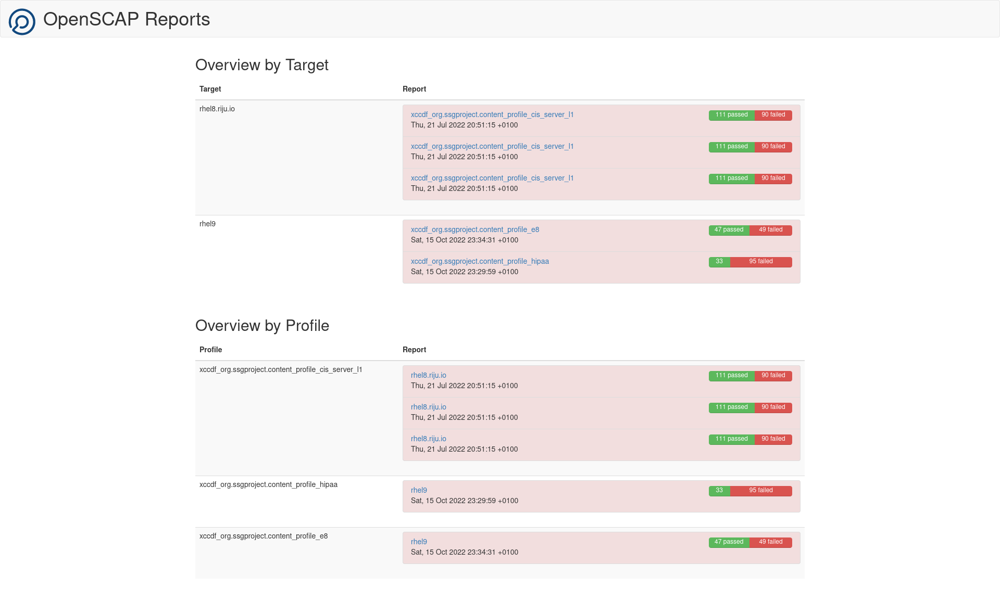
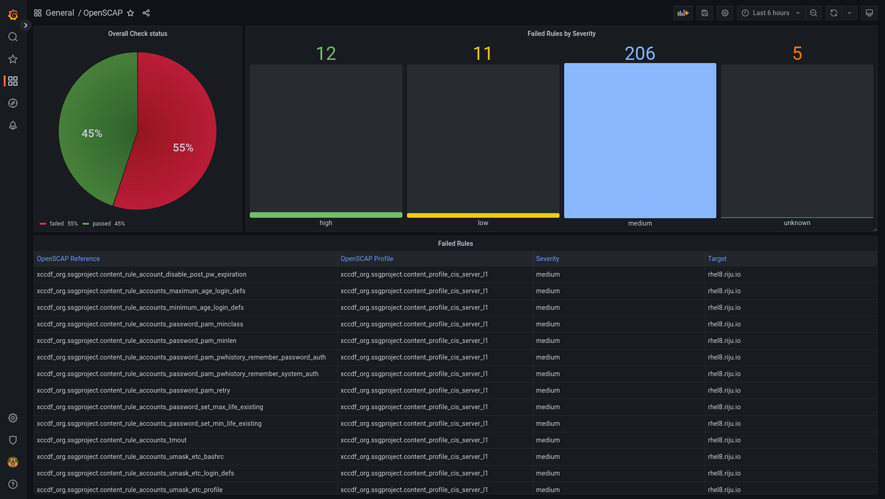

# OpenSCAP Report Publisher


[](https://goreportcard.com/report/github.com/jritter/openscap-report-publisher)
[](https://github.com/jritter/openscap-report-publisher/releases)
[](https://opensource.org/licenses/MIT)

The OpenSCAP Report Publisher can be used to transform and display raw ARF formated OpenSCAP repots into a human readable HTML report. It traverses a configurable directory (environment Variable REPORT_DIR), looks for ARF reports, and renders them into a HTML report, which will reside in the same directory. It can also handle bzip2 compressed xml files. For rendering, it relies on the `oscap` tool.

The reports are then exposed through an embedded web server, by default running on port 2112.



This tool has been implemented with the output of the [OpenShift Compliance Operator](https://docs.openshift.com/container-platform/4.11/security/compliance_operator/compliance-operator-understanding.html) in mind. The tooling of the operator only outputs the raw ARF format, and while the results can also be accessed through Kubernetes Resources (ComplianceCheckResult, ComplianceScan, ComplianceSuite), HTML reports are more handy in certain scenarios.

## How to Build and Run

The commands below have been tested on a Fedora 37 installation with working Golang 1.19 and Podman 4.3.1 installations. The build procedure most probably also works with Docker, but it has not been tested. Also, if you want to run the openscap-report-publisher standalone binary, please make sure that the `oscap` tool is installed. On RHEL and Fedora, this is part of the openscap-scanner package.

### Build the Code

```bash
go build
```

### Run the OpenSCAP Report Publisher

Make sure that the openscap-scanner Package is installed.

```bash
./openscap-report-publisher
```

### Build Container Image

The Container Image can be built using the existing Containerfile:

```bash
podman build -t ghcr.io/jritter/openscap-report-publisher:latest .
```

### Run the Container Image

Assuming that the ARF RAW Reports are sitting in resources/arf, the container image can be started as follows using podman:

```bash
podman run -v ./resources/reports:/opt/go/resources/reports:Z -it -p 2112:2112 ghcr.io/jritter/openscap-report-publisher:latest
```

## Prometheus Metrics

The openscap-report-publisher exposes a metric per rule, which indicated whether or not the rule is passed or not. The openscap-report-publisher webserver exposes these metrics under the URL `/metrics`  These metrics can be used to create interesting dashboards. This project also contains an [example dashboard](configs/grafana/openscap_dashboard.json).



### Some interesting Prometheus queries

#### Aggregate passed vs. not passed results

```promql
count_values("openscap_result", openscap_results)
```

### Percentage of passed checks

```promql
count(openscap_results == 1)/count(openscap_results)*100
```

#### Percentage of failed checks

```promql
count(openscap_results == 0)/count(openscap_results)*100
```

## Testing the metrics stack

This project contains a [compose file](compose.yaml), which brings up a [Prometheus](https://prometheus.io) and [Grafana](https://grafana.com/grafana/) along with the OpenSCAP Report Publisher, and preconfigures the scrape target and data source. This can be used to play around with the metrics that are exposed by the OpenSCAP Report Publisher.

The stack can be started by running

```bash
podman-compose up
```

This has been tested with podman-compose 1.0.3 on a Fedora 37. It should also work with docker-compose, but it has not been tested.

## Some Handy OpenSCAP commands

### Evaluate a Profile against a RHEL8 System

This example evaluates the CIS L1 Server Benchmark against a RHEL8 system and outputs an ARF formated report into the file arf.xml.

```bash
oscap xccdf eval --profile xccdf_org.ssgproject.content_profile_cis_server_l1 --results-arf resources/arf.xml /usr/share/xml/scap/ssg/content/ssg-rhel8-ds.xml
```

### Generate a HTML report

This command generates a HTML report (`resources/report.html`) from the ARF report, which was the output of the previous example.

```bash
oscap xccdf generate report --output resources/report.html resources/arf.xml
```

This is the command that the OpenSCAP report publisher executes in the background.

## Some OpenSCAP insights

While this section is not crucial as a user of this tool, it can be really helpful to understand the code.

### Example of passed rule

```xml
<arf:asset-report-collection xmlns:arf="http://scap.nist.gov/schema/asset-reporting-format/1.1" xmlns:core="http://scap.nist.gov/schema/reporting-core/1.1" xmlns:ai="http://scap.nist.gov/schema/asset-identification/1.1">
  <arf:reports>
    <arf:report id="xccdf1">
      <arf:content>
        <TestResult xmlns="http://checklists.nist.gov/xccdf/1.2" id="xccdf_org.open-scap_testresult_xccdf_org.ssgproject.content_profile_cis_server_l1" start-time="2022-07-21T20:51:15+01:00" end-time="2022-07-21T20:51:39+01:00" version="0.1.60" test-system="cpe:/a:redhat:openscap:1.3.6">
          <benchmark href="#scap_org.open-scap_comp_ssg-rhel8-xccdf-1.2.xml" id="xccdf_org.ssgproject.content_benchmark_RHEL-8"/>
          <title>OSCAP Scan Result</title>
          <identity authenticated="false" privileged="false">root</identity>
          <profile idref="xccdf_org.ssgproject.content_profile_cis_server_l1"/>
          <target>hostname.example.local</target>
          <target-address>127.0.0.1</target-address>
          <target-address>0:0:0:0:0:0:0:1</target-address>
          <rule-result idref="xccdf_org.ssgproject.content_rule_configure_crypto_policy" role="full" time="2022-07-21T20:51:16+01:00" severity="high" weight="1.000000">
            <result>pass</result>
            <ident system="https://nvd.nist.gov/cce/index.cfm">CCE-80935-0</ident>
            <check system="http://oval.mitre.org/XMLSchema/oval-definitions-5">
              <check-export export-name="oval:ssg-var_system_crypto_policy:var:1" value-id="xccdf_org.ssgproject.content_value_var_system_crypto_policy"/>
              <check-content-ref name="oval:ssg-configure_crypto_policy:def:1" href="#oval0"/>
            </check>
          </rule-result>
        </TestResult>
      </arf:content>
    </arf:report>
  </arf:reports>
</arf:asset-report-collection>
```

### Example of failed rule

```xml
<arf:asset-report-collection xmlns:arf="http://scap.nist.gov/schema/asset-reporting-format/1.1" xmlns:core="http://scap.nist.gov/schema/reporting-core/1.1" xmlns:ai="http://scap.nist.gov/schema/asset-identification/1.1">
  <arf:reports>
    <arf:report id="xccdf1">
      <arf:content>
        <TestResult xmlns="http://checklists.nist.gov/xccdf/1.2" id="xccdf_org.open-scap_testresult_xccdf_org.ssgproject.content_profile_cis_server_l1" start-time="2022-07-21T20:51:15+01:00" end-time="2022-07-21T20:51:39+01:00" version="0.1.60" test-system="cpe:/a:redhat:openscap:1.3.6">
          <benchmark href="#scap_org.open-scap_comp_ssg-rhel8-xccdf-1.2.xml" id="xccdf_org.ssgproject.content_benchmark_RHEL-8"/>
          <title>OSCAP Scan Result</title>
          <identity authenticated="false" privileged="false">root</identity>
          <profile idref="xccdf_org.ssgproject.content_profile_cis_server_l1"/>
          <target>hostname.example.local</target>
          <target-address>127.0.0.1</target-address>
          <target-address>0:0:0:0:0:0:0:1</target-address>
          <rule-result idref="xccdf_org.ssgproject.content_rule_partition_for_tmp" role="full" time="2022-07-21T20:51:16+01:00" severity="low" weight="1.000000">
            <result>fail</result>
            <ident system="https://nvd.nist.gov/cce/index.cfm">CCE-80851-9</ident>
            <check system="http://oval.mitre.org/XMLSchema/oval-definitions-5">
              <check-content-ref name="oval:ssg-partition_for_tmp:def:1" href="#oval0"/>
            </check>
          </rule-result>
        </TestResult>
      </arf:content>
    </arf:report>
  </arf:reports>
</arf:asset-report-collection>
```
